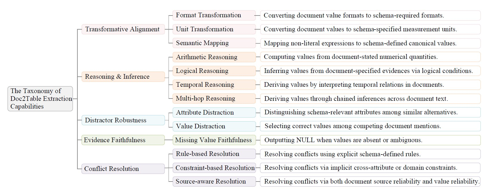
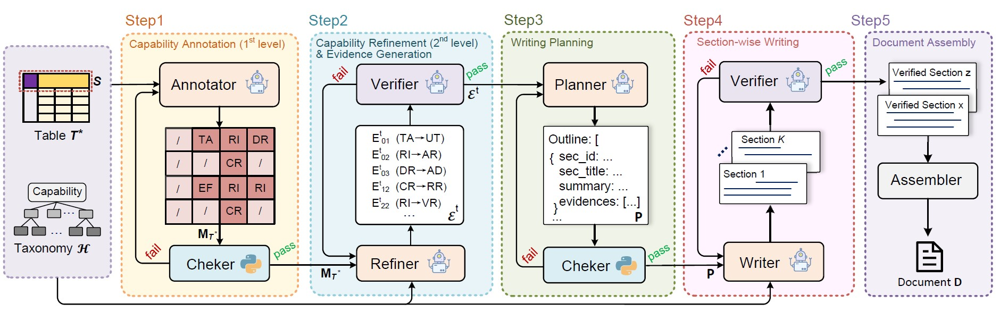
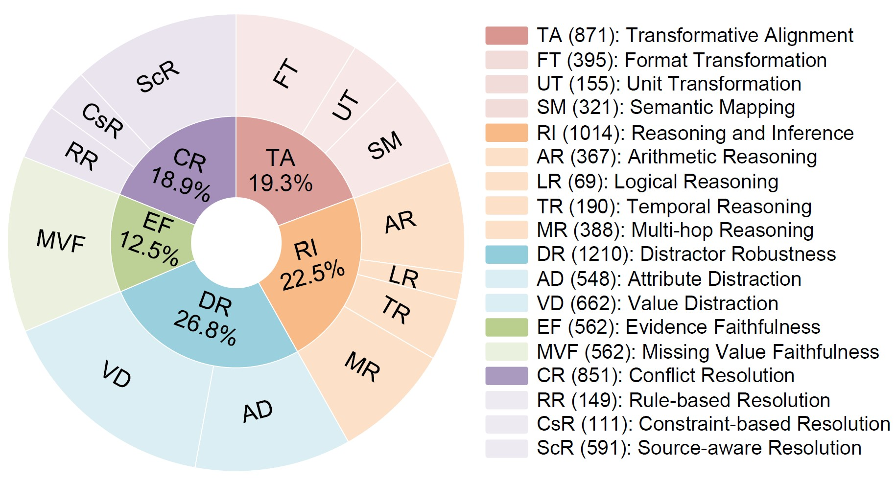

# DTBench: A Synthetic Benchmark for Document-to-Table Extraction

**DTBench** is the first capability-aware synthetic benchmark designed for evaluating **Document-to-Table (Doc2Table)** extraction. While Large Language Models (LLMs) have shown promise in flexible information extraction, their ability to produce precisely structured tables from complex documents—requiring transformation, reasoning, conflict resolution, and faithfulness—remains insufficiently understood.

DTBench addresses this by providing a comprehensive testbed covering 5 major categories and 13 fine-grained subcategories of Doc2Table extraction capabilities.

---

## 🧠 Capability Taxonomy

We organize the required Doc2Table capabilities into a two-level taxonomy to guide systematic evaluation.




---

## ⚙️ Table2Doc Synthesis Workflow

To ensure high-quality ground truth and scalability, DTBench is constructed using a reverse **Table2Doc paradigm**. We utilize a multi-agent workflow to synthesize documents from curated tables.



---

## 📊 Dataset Statistics

DTBench consists of **120 cases** with **8,811 cell-level evaluation instances**.




---

## 📂 Dataset Format
Each test case is provided in a comprehensive JSON format. Each entry includes the source table metadata, the synthesized unstructured document, and a strategy-labeled ground truth.

```json
{
    "name": "unique_case_name",
    "table": [ 
        {
            "table_title": "Original Table Metadata",
            "header": ["Column1", "Column2"],
            "data": [ ["Row1_Val1", "Row1_Val2"] ]
        }
    ],
    "document": "Synthesized unstructured text content...",
    "ground_truth": [
        {
            "header": [ ["Gauge"] ],
            "data": [
                [
                    {
                        "value": "750 mm",
                        "strategy": ["T3"] // Transformative Alignment--3th sub-capability (Semantic Mapping)
                    },
                    {
                        "value": "C.F. du Congo",
                        "strategy": [] // Directly Extractable
                    }
                ]
            ]
        }
    ]
}
